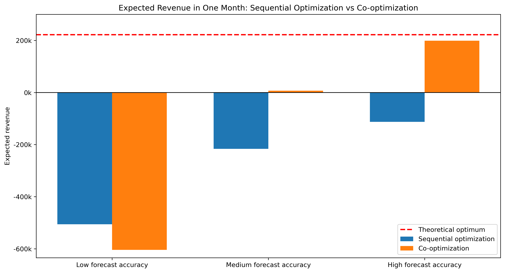
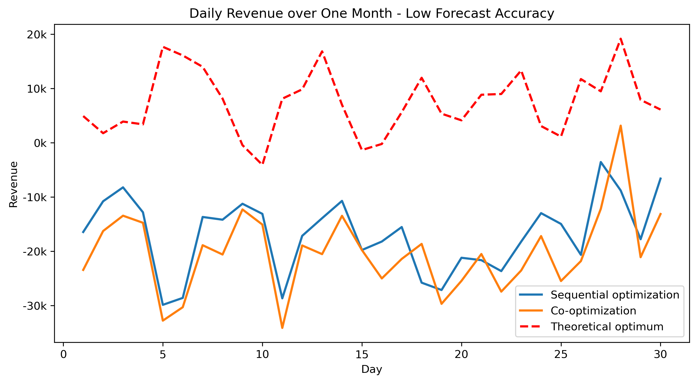
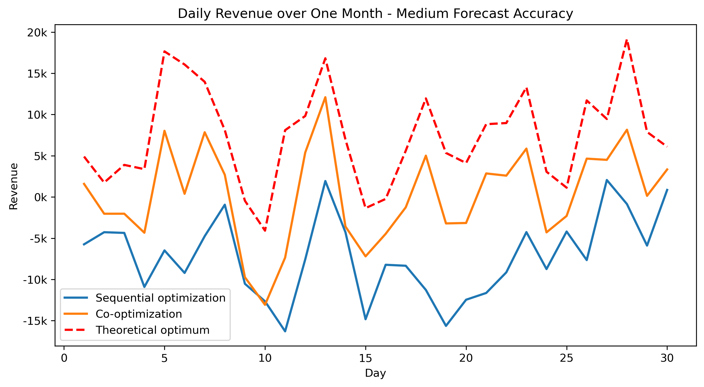
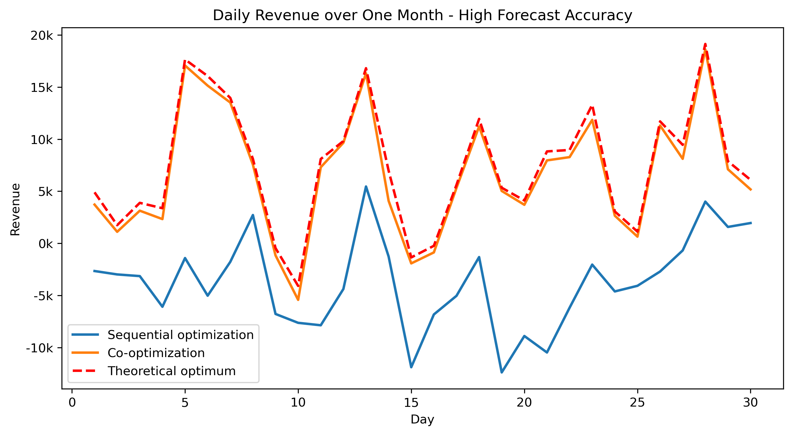

# BESS-PV Multi-Market Optimization Toy Demo

## Overview

This toy model demonstrates how a behind-the-meter site can be optimized together with its electricity market positions.

The site contains:

- PV generation
- Battery energy storage system (BESS)
- Local electricity demand
- Grid connection


The optimization jointly determines local asset operation and the site's positions in the day-ahead (DA) and imbalance (IMB) markets.

Two strategies are compared:

- **Sequential optimization across separate markets**
- **Co-optimization across DA and IMB markets**

The main question is:

> How much additional value can co-optimization capture across markets, and how sensitive is that value to electricity price forecast accuracy?

---

## Model Setup

- Single behind-the-meter site: PV + BESS + Load
- 24 hourly time steps per day
- One month of backtesting
- DA and IMB markets
- Three price forecast cases:
  - High forecast accuracy
  - Medium forecast accuracy
  - Low forecast accuracy
- Actual DA and IMB prices for same-day backtesting

---

## Workflow

The code follows four main steps:

```text
Data preprocessing
        ↓
Optimization
        ↓
Backtesting
        ↓
Visualization
```

1. **Data preprocessing**  
   Loads site data, forecast prices, and actual market prices.

2. **Optimization**  
   Solves both sequential optimization and co-optimization using forecast DA and IMB prices.

3. **Backtesting**  
   Evaluates the optimized decisions and calculates realized revenue using same-day actual prices.

4. **Visualization**  
   Compares total and daily realized revenue across different forecast accuracy levels.

---

## Key Results

<p align="center">
  
  
</p>

<p align="center">
  
  
</p>

- With **high forecast accuracy**, co-optimization significantly outperforms sequential optimization.
- With **medium forecast accuracy**, co-optimization still performs better, but the advantage becomes smaller.
- With **low forecast accuracy**, co-optimization can underperform sequential optimization.

The backtesting results show that the value of co-optimization depends strongly on forecast accuracy, illustrating a trade-off between **cross-market value extraction** and **forecast robustness**.

## Codebase Structure

```text
bess-pv-multimarket-optimization/
│
├── data/
│   ├── DERs_Data.xlsx
│   ├── Electricity_Price_Actual.xlsx
│   ├── Electricity_Price_Pred_High_Accuracy.xlsx
│   ├── Electricity_Price_Pred_Low_Accuracy.xlsx
│   └── Electricity_Price_Pred_Very_Low_Accuracy.xlsx
│
├── figures/
│   ├── expected_revenue.png
│   ├── daily_revenue_low.png
│   ├── daily_revenue_medium.png
│   └── daily_revenue_high.png
│
├── data_preprocessing.py
├── optimization.py
├── backtest.py
├── visualization.py
├── main.py
└── README.md
```

---

## Tools

- Python
- Gurobi
- NumPy
- Pandas
- Matplotlib
